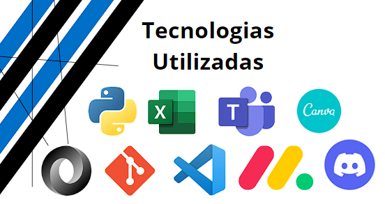
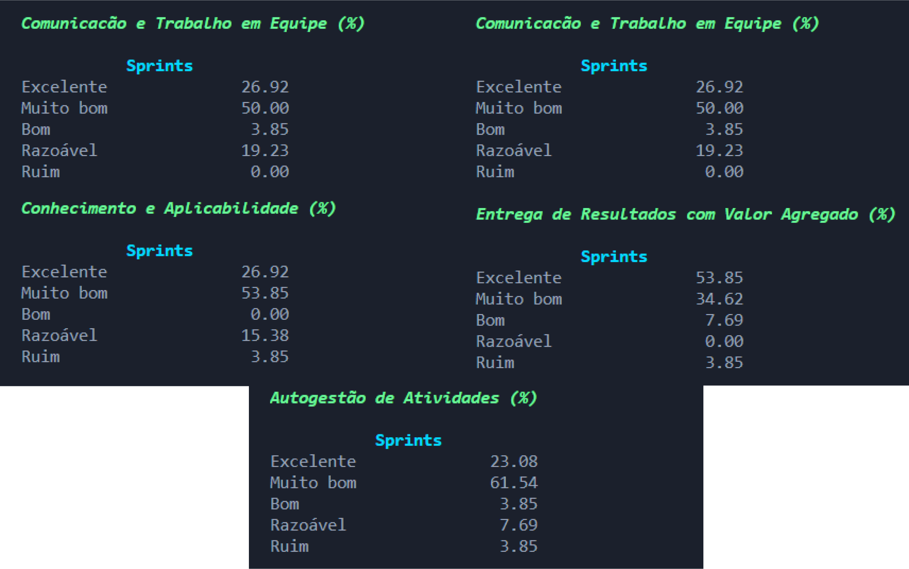
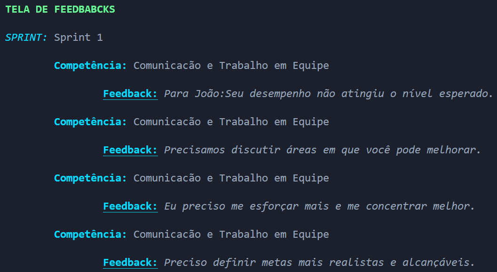

## 1º Semestre – 2023/1

 

### Apresentação do Parceiro: Cliente Interno (FATEC)
Para o 1° Semestre, devido a necessidade de aprendizagem e o contato inicial com a metodologia _Scrum_, o cliente foi interno, ou seja, a própria FATEC. 
Para uma dinâmica e vivência completa, contamos com apoio dos professores e Coordenador do Curso, sendo eles:
- Na função de P2: Lucas Gonçalves Nadalete;
- Na função de M2: Fabiano Sabha Walczak 
- Na função de Cliente (Coordenador de Banco de Dados, durante o desenvolvimento do projeto): Jose Walmir Gonçalves Duque 

### Objetivo do Projeto
Para o denvolvimento da API do 1° Semestre, aplicado na primeira etapa de 2023, tivemos o seguinte desafio:

A instituição de ensino PBLTex, especializada em cursos práticos de ensino, aplicando a PBL (_Problem Based Learning_), desenvolveu uma dinâmica de Avaliação Democratizada baseada na técnica de Avaliação 360°. 
Dessa forma, o foco do projeto foi no desenvolvimento de uma aplicação tecnológica para uma Avaliação Democratizada,permitindo o levantamento, análise e desenvolvimento de futuras resoluções, através das funcionalidades criadas.

Segue link para conhecer a aplicação _Avaliação 360°_:

[Aplicação _Avaliação 360°_](https://github.com/iNineBD/Aval360-1Sem2023)

#### Tecnologias Utilizadas
As tecnologias utilizadas foram:

- _Python_: linguagem utilizada no projeto;
- _Visual Studio Code_: IDE definida para uso de todo o time de desenvolvimento;
- _Excel_: uso interno na equipe, para o controle das avaliações do time durante as sprints, dashboards e apoio no desenvolvimento do _burndown_;
- _Json_: utilizado para o registro dos dados gerados durante a execução da aplicação.
- _Git_ e _GitHub_: escalabilidade, disponibilidade e rastreamento de todo o projeto, a fim de manter as informações e acessos para todos os integrantes de maneira prática;
- _Monday_: para registrar/movimentar as tasks e acompanhar a conclusão de todo o backlog proposto;
- _Discord_: reuniões da equipe para apoio no desenvolvimento do projeto;

#### Contribuições Pessoais
Para a elaboração e desenvolvimento do projeto no 1° semestre as minhas contribuições foram:
- _Product Owner_: interagi com o cliente, na função de Product Owner (PO) durante todo o projeto, a fim de melhor compreender o produto a ser desenvolvido, para repassar ao Time de Desenvolvimento.
- _Developer_: realizei algumas tasks para apoiar o time, atuando diretamente no backend. 

Sendo assim, seguem minhas contribuições por Sprint, neste projeto:

- _Sprint 1_:

Responsável por entender, conversar com o cliente e realizar o planejamento do Backlog:

|  **ÉPICO**  | **USER STORY** | **PRIORIDADE** | **SPRINT** | **STATUS** |
|-------------------------|---------------------|----------------|-------------------------|------------------------|
| Avaliação 360° | O sistema deve realizar uma avaliação dos integrantes do time e uma autoavaliação para analisar o desempenho como equipe | Alta | 2 | **Realizado** |
| Avaliação 360° | A avaliação deve ter respostas baseadas em uma escala Likert (5 valores), seguindo fatores fixos a serem avaliados | Alta | 2 | **Realizado** |
| Controle de Usuário | O sistema deve conter um controle de usuários, de uso exclusivo do administrador, com as funções de editar, excluir e promover usuários a administrador | Média | 3 | **Realizado** |
| Controle de Usuário | O sistema deve conter um controle de perfil que possibilita a realização do login, onde é possível diferenciar o usuário do administrador |  Média | 3 | **Realizado** |
| Controle de Turmas | Ter um controle para turmas que possibilite e permita que o administrador consiga gerir os times dentro de uma turma  | Média | 2 | **Realizado** |
| Controle de Times | Ter um controle para times que possibilite gestão de usuários dentro do time (sendo que está dentro de uma turma)| Média | 2 | **Realizado** |
| Controle de Sprints | Um controle sprint onde o administrador fazer a gestão de todas as informações da sprint | Média | 3 | **Realizado** |
| Dashboards | Dashboards a partir de dados de avaliações respondidas no decorrer das sprints para que o cliente tenha melhor análise dos resultados de desempenho | Alta | 4 | **Realizado** | 
| Backlog | O projeto precisa ser estruturado de acordo com a metodologia ágil, contendo todos os tópicos exigidos pelo cliente | Alta | 1,2,3 | **Realizado** |
| Design | Aprimorar a visualização do sistema no console, de forma organizada e com cores de maior destaque | Alta | 4 | **Realizado** |
| Fluxograma | Um protótipo que permite uma visualização ramificada do sistema | Baixa | 1 | **Realizado** |

- _Sprint 2_: 

Realizado o Controle de Times: Para acessar o Controle de Times, se faz necessário acessar o Controle de Turmas. Por tanto, um Time precisa pertencer a uma Turma e somente essa inclusão permitirá a aplicação adequada da Avaliação 360°.
É através do Controle de Times que se torna possível gerenciar todas as informações dos usuários e visualizar a evolução da Avaliação.

Nesta etapa, auxiliei no desenvolvimento nas seguintes funcionalidades:
Criar novo Time;
Visualizar turmas;

Segue vídeo da aplicação, para Controle de Times:
[Clique aqui para ver o vídeo de demonstração](Videos/Controle_Times_1Sem.mp4)

- _Sprint 3_:

Realizado o Controle de Sprint: gerenciamento e acompanhamento das avaliações realizadas em ciclos curtos e iterativos, para facilitar o controle e a gestão da aplicação. É no controle de sprints, que é possível criar, editar, visualizar e excluir sprints, bem como gerenciar as tarefas atribuídas a cada uma delas.
	  
Nesta etapa, atuei no desenvolvimento da funcionalidade de:
Editar Sprints:

Segue vídeo da aplicação, para "Editar Sprints":
[Clique aqui para ver o vídeo de demonstração](Videos/Controle_Sprints_1Sem.mp4)

Atualização e reestruturação do Backlog:

|  **ÉPICO**  | **USER STORE** | **PRIORIDADE** | **SPRINT** | **STATUS** |
|-------------------------|---------------------|----------------|-------------------------|------------------------|
| Avaliação 360° | O sistema deve realizar uma avaliação dos integrantes do time e uma autoavaliação para analisar o desempenho como equipe | Alta | 2 | **Realizado** |
| Avaliação 360° | A avaliação deve ter respostas baseadas em uma escala Likert (5 valores), seguindo fatores fixos a serem avaliados | Alta | 2 | **Realizado** |
| Controle de Usuário | O sistema deve conter um controle de usuários, de uso exclusivo do administrador, com as funções de editar, excluir e promover usuários a administrador | Média | 3 | **Realizado** |
| Controle de Usuário | O sistema deve conter um controle de perfil que possibilita a realização do login, onde é possível diferenciar o usuário do administrador |  Média | 3 | **Realizado** |
| Controle de Turmas | Ter um controle para turmas que possibilite e permita que o administrador consiga gerir os times dentro de uma turma  | Média | 2 | **Realizado** |
| Controle de Times | Ter um controle para times que possibilite gestão de usuários dentro do time (sendo que está dentro de uma turma)| Média | 2 | **Realizado** |
| Controle de Sprints | Um controle sprint onde o administrador fazer a gestão de todas as informações da sprint | Média | 3 | **Realizado** |
| Dashboards | Dashboards a partir de dados de avaliações respondidas no decorrer das sprints para que o cliente tenha melhor análise dos resultados de desempenho | Alta | 4 | **A Realizar** | 
| Backlog | O projeto precisa ser estruturado de acordo com a metodologia ágil, contendo todos os tópicos exigidos pelo cliente | Alta | 1,2,3 | **Realizado** |
| Design | Ter uma visualização clara, organizada e com cores de maior destaque | Alta | 4 | **A Realizar** |
| Fluxograma | Um protótipo que permite uma visualização ramificada do sistema | Baixa | 1 | **Realizado** |

- _Sprint 4_:

Realizados os Dashboards para acesso do Administrador:

Dashboard Global: visualização de todas as sprints como um todo, contendo as notas obtidas pela avaliação 360° através de médias

Dashboard Turmas, Times, Integrantes: fornecem informações sobre as Turmas, Times e Integrantes:

Feedback: Para que Integrante(Aluno) tenha conhecimento do "motivo" da nota baixa. 

O feedback é obrigatório sempre que for inserido uma nota menor ou igual a 3, as informações de feedback são salvas no sistema e o Integrante pode visualiza-las sempre que necessário.

#### Hard Skills
  - Estuturação do Backlog: faço com autonomia;
  - Desenvolvimento utilizando Python: sei fazer com ajuda/pesquisa;
  - GitHub: o uso do GitHub e de commits eu sei fazer com ajuda/pesquisa;

#### Soft Skills
Precisei desempenhar e desenvolver muito a comunicação para interagir as pessoas. Apesar de ser comunicativa, foi desafiador conseguir entender:
- As referências relacionadas as tecnologias, já que eu vim de uma outra área e nunca tive contato com as ferramentas utilizadas;
- Dinâmica/funcionamento e as boas práticas da metodologia Scrum;
- Saber interagir/conversar com o cliente: por mais que o projeto tenha sido sem um cliente externo, a dinâmica exigiu um comprometimento e um comportamento à altura;
- Aprender atuar como PO: saber/entender o problema do cliente e repassar ao time de desenvolvimento;
	

