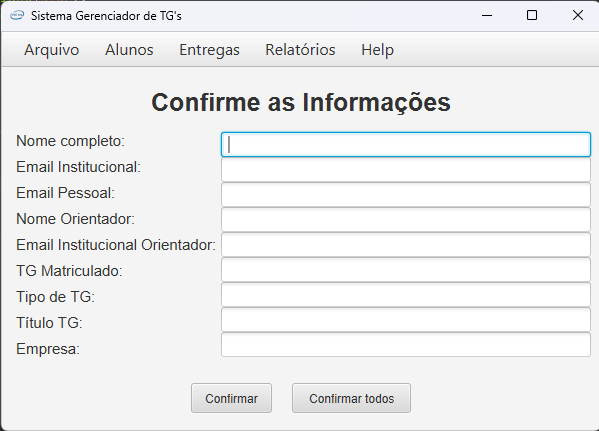

## 2º Semestre – 2023/2

 

### Apresentação do Parceiro (Empresa) - Quem é?

Para o 2° Semestre, a API contou novamente com o Cliente Interno: FATEC.

### Objetivo do Projeto
Para o desenvolvimento da API do 2° Semestre, foi proposto o seguinte desafio:

Para o curso de Análise e Desenvolvimento de Sistemas (ADS), a FATEC – São José dos Campos enfrenta diversos desafios no gerenciamento dos Trabalhos de Graduação (TGs), principalmente devido à ausência de um sistema prático e eficiente para essa finalidade. A ausência de uma organização, dificulta o acompanhamento do progresso dos alunos e compromete a gestão dos projetos.

Dessa forma, foi solicitado o desenvolvimento de um Sistema de Gerenciamento de Banco de Dados, com o objetivo de centralizar e simplificar toda a administração dos TGs. A ferramenta será utilizada para um acompanhamento mais eficaz das etapas, prazos de entrega e status dos projetos, promovendo maior controle e organização ao longo do processo.

Segue link para conhecer a aplicação _Sistema Gerenciador de TGs_:

[Aplicação _Sistema Gerenciador de TGs_](https://github.com/iNineBD/SGTG-2Sem2023)

#### Tecnologias Utilizadas
As tecnologias utilizadas foram:

- _Java_: linguagem utilizada no projeto;
- _Eclipse_: IDE definida para uso de todo o time de desenvolvimento;
- _MySQL_: Banco de Dados utilizado para o gerenciamento dos dados da aplicação;
- _JavaFX_: _framework_ utilizado para a a criação das interfaces gráficas da aplicação (frontend);
- _Clickup_: para registrar/movimentar as tasks, registrar o tempo médio na realização dos cards (tarefas) e acompanhar a conclusão de todo o backlog proposto;
- _Figma_: elaborado os protótipos das telas para validação com o cliente e modelo para o Time de Desenvolvimento.

#### Contribuições Pessoais
Para a elaboração e desenvolvimento do projeto no 2° semestre, atuei como _Developer_. 

Seguem os desenvolvimentos de cada sprint, estruturadas da seguinte forma:

- _Sprint 1_:
Responsável por elaborar os protótipos das seguintes telas:

Tela inicial e para carregar CSV:: é a primeira tela apresentada para o usuário. Possui um barra de ferramentas, onde todas as demais funcionalidades do sistema podem ser acessadas.
    

    
Tela de Gerenciar Alunos: 

Em "Gerenciar Alunos" os dados de todos os alunos são exibidos de forma resumida. Na coluna de ações há dois botões, para visualização do aluno e feedback.

E também a tela "Nome Aluno" os elementos são particulares de apenas um aluno, sendo possível modifica-los a partir do botão "Editar aluno".

Tela de Confirmação: idealizada para que o usuário visualize todas as informações preenchidas pelo aluno no questionário que foram carregadas do CSV, e caso haja algum erro nas informações, será nesta tela que o usuário poderá modifica-las.

- _Sprint 2_:
Desenvolvimento de alguns filtros no backend para aplicação, sendo:

Filtro para o Nome;

Filtro do nome e e-mail institucional; 

- _Sprint 3_:
Iniciado o desenvolvimento do relatório de orientador x aluno, destinado para o "Professor", que fosse utilizar a aplicação;

- _Sprint 4_:
Finalizado o relatório de Orientador X Aluno, nomeado como "Transporte Notas". O objetivo é associar os dois dados para geração do relatório:

#### Hard Skills
- Figma para desenvolvimento de protótipo: sei fazer com autonomia;
- Java: sei fazer com ajuda/pesquisa;
- Eclipse: sei utilizar com autonomia;
- GitHub: eu sei fazer com ajuda/pesquisa;

#### Soft Skills
Precisei desempenhar/desenvolver habilidades voltadas totalmente para o a função de _Developer_, já que as minhas tasks estavam relacionadas ao frontend e backend. Além disso, foi desafiador pois a linguagem e a IDE utilizadas, foram diferentes do proposto no 1° semestre.

